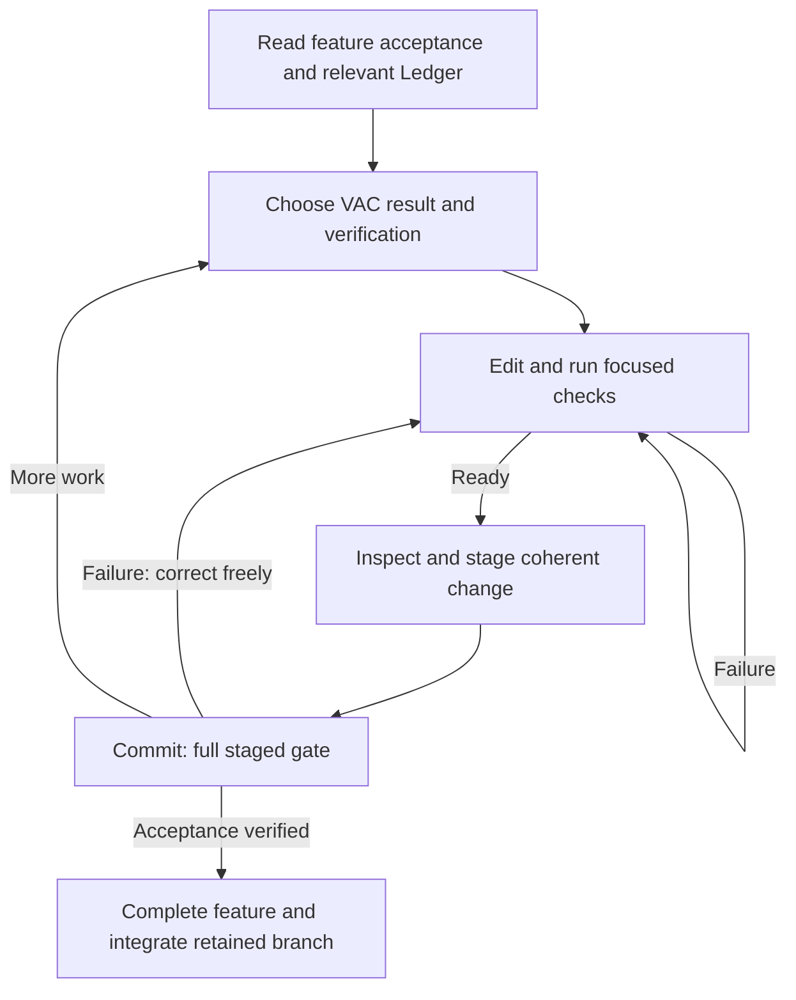

# Discipline Worker

A reusable worker environment for feature delivery through verified atomic changes (VACs), with explicit decisions, executable invariants, guarded agent commands, complexity reminders, and one quality gate.

Product code lives under Project. Its sibling Ledger holds the feature plan, decisions, and invariants. Start with just list and Ledger/Plan.md.

A VAC is one cohesive, independently checkable and revertible change. It may require multiple files, edits, tests, and corrections. Define its result and verification, iterate with focused checks, inspect and stage the change, and commit. The pre-commit hook verifies the staged tree before accepting the commit. Completed VACs live in Git; there is no separate VAC registry or per-edit lock.

The agent chooses meaningful VAC boundaries and checks; the harness enforces the commit gate. The gate cannot prove semantic atomicity or that a test fully captures user intent. Failed checks permit immediate fixes. Full checks need not be repeated manually before the pre-commit gate.

The former edit checkpoint is retired by [D011](Ledger/Decisions/011.md). Its adapter remains inert for already loaded sessions and historical links. Existing `.git/codex-edit-*` and `.git/codex-commit-failed` files have no effect. Complexity reminders and the Just command guard remain active.
