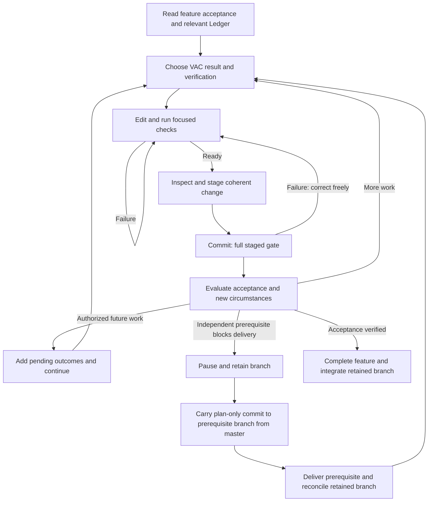

# Discipline Worker

A reusable worker environment for feature delivery through verified atomic changes (VACs), with explicit decisions, executable invariants, guarded agent commands, complexity reminders, and one quality gate.

Product code lives under Project. Its sibling Ledger holds the feature plan, decisions, and invariants. Start with just list and Ledger/Plan.md.

[State](Ledger/State.md) is the compact current-work snapshot for a fresh session or interruption recovery. It records Focus, Workspace, Progress, Verification, Blockers, and Next action. Read it alongside Plan and compare its claims with Git before acting. Refresh it at meaningful VAC boundaries, blockers, and handoffs, and before known context resets; an abrupt crash can leave it stale. It is replaceable working context, not a second plan, authorization source, or VAC history. The gate checks its required nonempty sections, not the truth of its contents.

All registered pre-tool checks use the [Rust worker runtime](tooling/worker/README.md) through tooling/worker/run. SessionStart points fresh/resumed/compacted sessions at State and Plan and preserves the full complexity reminder. Before Edit, Write, or apply_patch, the dispatcher selects the short editing skill for each affected Ledger index or detail file, including both sides of a rename:

- Plan: [edit-plan](.agents/skills/edit-plan/SKILL.md).
- Decisions: [edit-decisions](.agents/skills/edit-decisions/SKILL.md).
- Invariants: [edit-invariants](.agents/skills/edit-invariants/SKILL.md).
- State: [edit-state](.agents/skills/edit-state/SKILL.md).

These file-specific reminders add context without denying a tool call or claiming the skill was read. Existing complexity refresh denials and the shell command guard retain their behavior. Arbitrary shell write targets cannot be inferred reliably, so just write receives a conditional reminder to apply only matching skills. The Rust dispatcher owns the native guard and complexity implementations; Python versions remain historical parity references.

Features describe product outcomes and observable acceptance, including substantial MVP capabilities or optimizations. The agent chooses architecture and delivery steps. [Plan](Ledger/Plan.md) documents the Markdown schema: stable IDs, delivery order, pending/active/paused/complete states, and explicit prerequisites. At most one feature is active; zero is valid. Paused features record blocker and resumption context, while completed features record acceptance verification.

A VAC is one cohesive, independently checkable and revertible change. It may require multiple files, edits, tests, and corrections. Define its result and verification, iterate with focused checks, inspect and stage the change, and commit. The pre-commit hook verifies the staged tree before accepting the commit. Completed VACs live in Git; there is no separate VAC registry or per-edit lock.

The agent chooses meaningful VAC boundaries and checks; the harness enforces the commit gate. The gate cannot prove semantic atomicity or that a test fully captures user intent. Failed checks permit immediate fixes. Full checks need not be repeated manually before the pre-commit gate.

The former edit checkpoint is retired by [D011](Ledger/Decisions/011.md). Its adapter remains inert for already loaded sessions and historical links. Existing `.git/codex-edit-*` and `.git/codex-commit-failed` files have no effect. Complexity reminders and the Just command guard remain active.

Plan evolution follows [D012](Ledger/Decisions/012.md) and the [execution skill](.agents/skills/execute-plan-feature/SKILL.md). A technical obstacle can stay inside a VAC. A necessary independent outcome becomes a prerequisite; justified follow-ups and user or authorized manager instructions can extend the future plan while current work continues. Required acceptance work cannot be deferred and still count as completion. There is no automatic manager agent or second planning database.

For a blocker, keep verified commits on the paused branch, finish or discard only its uncommitted VAC, and transfer a separate plan-only commit to the new prerequisite branch. This returns the working tree to master without publishing unfinished product code. After the prerequisite is integrated, reconcile the retained branch with current master and the latest Plan before continuing. The execution skill includes the concrete commands and conflict rules.

The standard gate checks Markdown contracts and dependency consistency alongside Ruff, strict mypy, pytest, typos, and Vulture. It rejects malformed plan rows, duplicate or unknown dependencies, cycles, multiple active features, and active or completed features whose prerequisites are unfinished. Product meaning, justified scope, and adequate acceptance evidence remain agent responsibilities governed by the existing skills.

Rust structural lint is configured in [lint.toml](tooling/worker/lint.toml): rules declare targets, path/extension selectors, warning/error thresholds, ordered overrides, and skills for both levels. Run just lint or just lint-rules. The same native linter checks staged commits and integration candidates; other gate failures also emit configured skill guidance. See the [runtime guide](tooling/worker/README.md) for schema, examples, build/cache behavior, and adding rules/language support.
